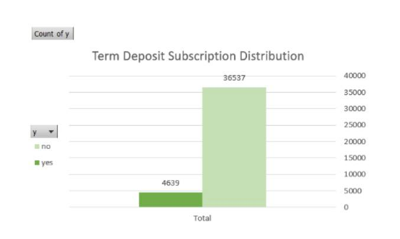
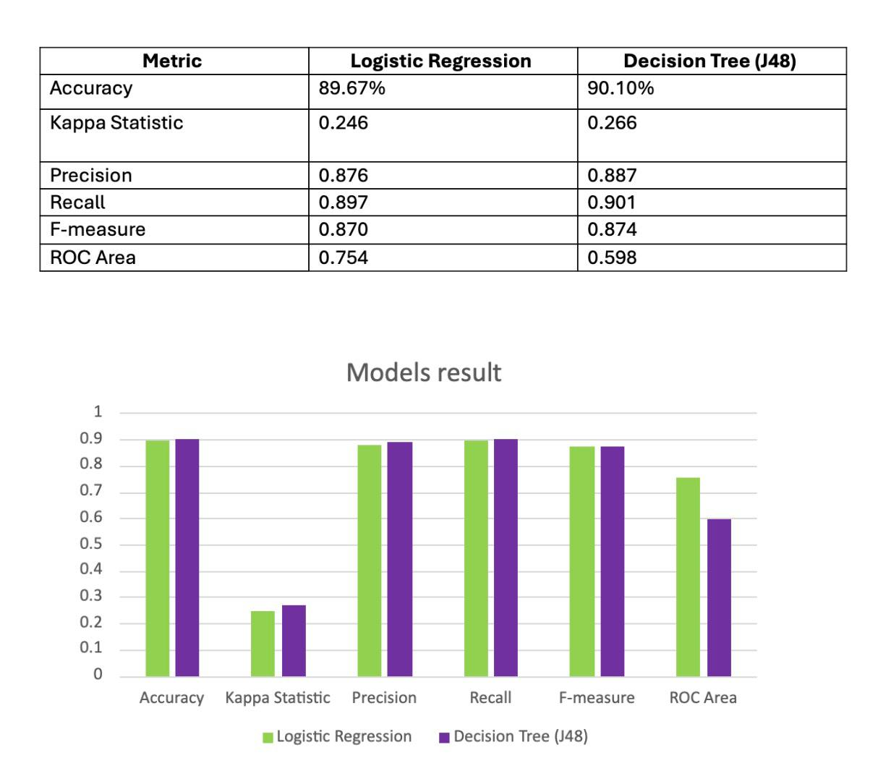

# Bank Marketing Campaign – Machine Learning

## Project Overview
This academic machine learning project focuses on predicting whether bank customers will subscribe to a term deposit based on a marketing campaign dataset.

The dataset contains approximately 41,000 customer records and was obtained from Kaggle. The project included data preparation, preprocessing, model building, and performance evaluation using Weka and Excel.

## Machine Learning Models
Two classification models were used:

- Decision Tree (J48)
- Logistic Regression

The models were evaluated and compared using multiple performance metrics, including Accuracy, Precision, Recall, F-Measure, Kappa Statistic, and ROC Area.

## Results

| Metric | Logistic Regression | Decision Tree (J48) |
|---|---:|---:|
| Accuracy | 89.67% | 90.10% |
| Kappa Statistic | 0.246 | 0.266 |
| Precision | 0.876 | 0.887 |
| Recall | 0.897 | 0.901 |
| F-Measure | 0.870 | 0.874 |
| ROC Area | 0.754 | 0.598 |

Decision Tree (J48) achieved better performance across most evaluation metrics, while Logistic Regression achieved a higher ROC Area.

## My Contribution
- Proposed the project idea and selected the dataset from Kaggle.
- Contributed to data cleaning and preparation.
- Performed data standardization using Weka.
- Contributed to building the classification models.
- Analyzed and evaluated model performance.
- Compared the model results to identify differences in performance.

## Tools
- Weka
- Microsoft Excel
- Kaggle

## Skills Demonstrated
- Machine Learning Fundamentals
- Data Preprocessing
- Data Cleaning
- Classification
- Model Evaluation
- Performance Metrics Analysis

  ## Dataset Distribution

## Model Comparison

